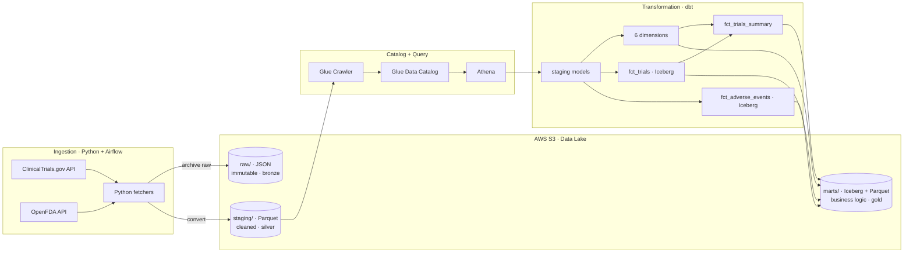
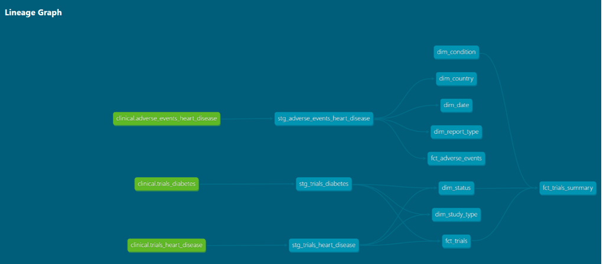

# Clinical Data Platform

An end-to-end **ELT pipeline** that ingests public clinical-trial and adverse-event data, lands it in **AWS S3**, and transforms it with **dbt** into two dimensional star schemas on **Apache Iceberg** — orchestrated with **Airflow**, queried through **Athena**, and provisioned with **Terraform**.

> Built as a hands-on data-engineering project. It mirrors a pattern from my background in clinical data management: the cross-source reconciliation and quality checks I used to write by hand are now version-controlled **dbt tests** that run automatically on every build.

---

## Architecture



*Airflow orchestrates the ingestion DAG (fan-in to the Glue crawler). Terraform provisions all AWS infrastructure. GitHub Actions runs CI on every push.*

*S3 + Glue Catalog + Athena + **Iceberg** together form a **lakehouse**: open-format files in object storage, a SQL/table layer on top, and ACID table semantics (atomic writes, `MERGE`, snapshot isolation, time travel) on the fact tables — no separate warehouse.*

**Flow:** Python fetchers pull data from the ClinicalTrials.gov and OpenFDA APIs. Each raw response is archived as **JSON in S3 `raw/`** (an immutable, replayable copy), then converted to **Parquet and landed in S3 `staging/`**. A **Glue crawler** catalogs `staging/` into the Glue Data Catalog, so **Athena** can query it via schema-on-read. **dbt** then models the data: a **staging** layer cleans and standardizes each source, and a **marts** layer builds two star schemas plus an aggregate, materializing its output back to S3 under `marts/`.

---

## Tech stack

| Layer | Tooling |
|---|---|
| Ingestion | Python, `requests`, `boto3` |
| Storage / Lake | AWS S3 — medallion: `raw/` (JSON), `staging/` + `marts/` (Parquet) |
| Table format | Apache Iceberg (fact tables) |
| Catalog / Query | AWS Glue (crawler + Data Catalog), Athena |
| Transformation | dbt (staging → marts, tests, docs/lineage) |
| Orchestration | Apache Airflow (Dockerized) |
| Infrastructure | Terraform (S3, versioning, Glue role/DB/crawler) |
| CI | GitHub Actions |

---

## How it works

**Medallion layout in S3.** Three prefixes, each its own layer, kept separate so they never collide:
- **`raw/` (JSON)** — write-once, immutable source of truth. If a downstream transform breaks or a schema changes, the pipeline can be reprocessed from here without re-calling the APIs (which rate-limit and change over time).
- **`staging/` (Parquet)** — cleaned, columnar, query-ready. This is the *only* prefix the Glue crawler scans, which keeps the catalog clean (one format per prefix → one table per folder).
- **`marts/` (Iceberg + Parquet)** — business-logic output (gold). dbt writes here and registers the tables in the catalog itself, so dbt and the crawler never fight over the same tables.

**Schema-on-read.** Athena stores nothing. The Glue crawler scans `staging/` and writes table definitions — location, schema, and format — into the Glue Data Catalog. At query time Athena reads the catalog, then reads the Parquet files straight from S3. Nothing is ever loaded into a database.

**dbt transformation.**
- **Staging** models mirror each raw source one-to-one, flatten nested fields to snake_case, and standardize types. Materialized as **views**. This layer uses dbt `source()`.
- **Marts** apply business logic as **two star schemas**, since trials and adverse events share no common key:
  - **`fct_trials`** — grain is one row per **trial × condition** (a trial studying comorbid conditions legitimately appears twice). Built by `UNION ALL` of the two trials staging models. Conformed to `dim_condition`, `dim_status`, `dim_study_type`.
  - **`fct_adverse_events`** — grain is one row per **safety report**, with three boolean measures. Conformed to `dim_country` (**role-playing** — joined twice, as reporting country and country of occurrence), `dim_date`, `dim_report_type`.
  - **`fct_trials_summary`** — an aggregate over `fct_trials`, joined back to `dim_condition` and `dim_status` for labels, giving trial counts and total enrollment.
- **Materializations** are chosen per model: staging as **views**; both fact tables as **Iceberg incremental `merge`**, so reruns upsert on the unique key instead of duplicating rows; dimensions and the aggregate as plain **tables**, since they rebuild fully and merge semantics would buy nothing.
- **Tests** run on every build across both layers — `not_null`, `unique`, `accepted_values`, `unique_combination_of_columns` on the composite grain of `fct_trials`, and **`relationships`** foreign-key checks from both fact tables to every dimension. Those last ones are the automated equivalent of the manual reconciliation checks behind a clinical database lock.

**Orchestration.** The Airflow DAG fetches all three sources in parallel, archives raw, converts and uploads to staging, then **fans in** to a single Glue-crawler trigger once all uploads complete.

---

## dbt lineage

The dbt-generated lineage graph — sources → staging → marts:

<!-- Run `dbt docs generate` then `dbt docs serve --port 8081`, open the lineage graph, screenshot it, save as docs/lineage.png -->


---

## Data sources

| Source | API | Notes |
|---|---|---|
| Trials (heart disease) | ClinicalTrials.gov v2 | Nested JSON, flattened in staging |
| Trials (diabetes) | ClinicalTrials.gov v2 | Same schema as above |
| Adverse events | OpenFDA (FAERS) | Currently a **heart-disease-filtered slice**, not all FAERS data |

> Trials and adverse events share **no common key** (`nct_id` vs `safety_report_id`), so they are modeled as **two separate stars** rather than forced into a join.

---

## Running it locally

```bash
# Infrastructure
cd terraform && terraform init && terraform apply

# Ingestion + orchestration (Airflow in Docker)
cd airflow && docker compose up

# dbt (from inside clinical_dbt/, with venv active)
dbt deps
dbt build          # run + test
dbt docs generate && dbt docs serve --port 8081
```

---

## Next steps / roadmap

- **Stateless S3 tasks.** The DAG currently passes *local file paths* between tasks, which assumes a shared filesystem (fine on LocalExecutor, but breaks under distributed executors like Celery/Kubernetes). Refactor to write to and read from S3 directly, passing S3 keys so tasks are stateless and portable.
- **Incremental predicates.** The fact models use `incremental` + `merge`, which makes reruns idempotent, but they still re-scan the full source each run. Add `is_incremental()` watermark filters so the scan shrinks as well as the write.
- **Stronger CI.** Have GitHub Actions run `dbt build` (compile + run + test) on every push, not just `dbt parse`. Needs an AWS credentials strategy.
- **Rename the adverse-events mart** to reflect that it is a heart-disease-filtered slice — the S3 prefixes already say `heart_disease`, the model name does not.
- **S3 lifecycle rule** on `athena-results/` to expire query output.